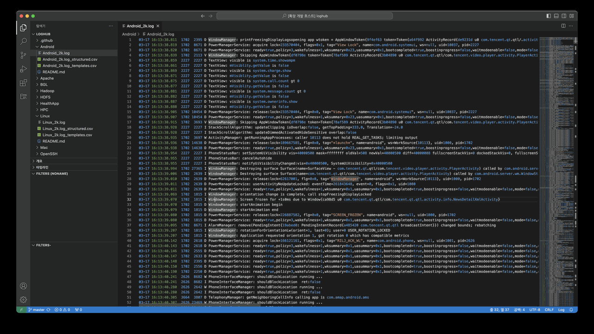
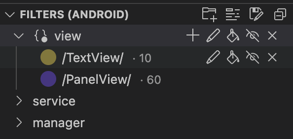
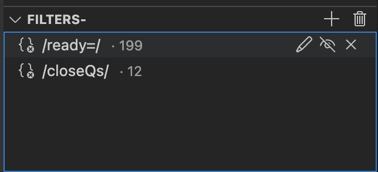
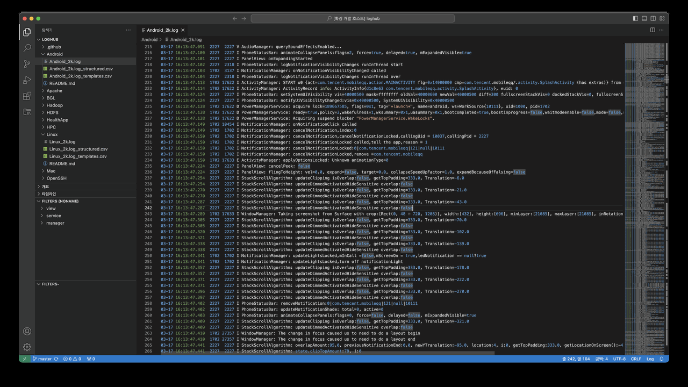

# Log Analysis Beta

Highlight your logs with colorful filters, and manipulate what to display for better log file reading. This helps you focus on log analysis and use your time efficiently.

This extension is a fork of the [Log Analysis](https://github.com/SoySauceFor3/log-analysis) project, created to introduce and test new features in advance or to implement upcoming requirements. The goal of this project is to eventually contribute these enhancements back to the original Log Analysis project for long-term integration.
We encourage you to freely share any issues or suggestions for improvement you encounter while using this extension. Your feedback is valuable and helps us enhance the project.

## Features

- Create filters using regular expressions provided by the user
- Highlight lines that match the filters
- Focus mode: display only lines that match your filters, hiding everything else for better readability
- Exclude meaningless filters from the filtered content in Focus mode for more accurate log analysis
- Organize filters into groups based on their purpose and apply changes to the entire group collectively
- Manage filters on a per-project basis to accommodate different log formats across various devices and frameworks

## Usage

We distinguish between [Basic Users](#basic-users) and [Advanced Users](#advanced-users) to cater to different user needs and expertise levels. Basic Users focus on simple filter management for log analysis without needing to understand or interact with project features. In contrast, Advanced Users manage multiple projects and filter configurations to handle more complex log analysis scenarios.

### Basic Users

Basic users simply set up and manage filter groups to use for log analysis. The Primary SideBar (`FILTERS+`/`FILTERS-`) is designed for their use, where they can configure filters within these groups without worrying about project management. They can save the filter configurations for reuse, ensuring that settings persist even after restarting VSCode. If users don’t need the advanced project management features, they can disable the ActivityBar (`Log Analysis Beta`) menu for a simpler interface.

#### Basic Operation

The basic operation for log analysis is as follows.

For basic users, log analysis can be performed directly in the `FILTERS+` tab without needing to access the `Log Analysis Beta` menu. The `FILTERS+` tab, a **NONAME** project is automatically created and used. When saving filters, the project will be saved, and a message confirming the save will appear in the status bar. The tab will display all the necessary filter groups, where users can activate filters or control highlights to focus on log analysis using Focus Mode.

The left editor holds the original document, and all the lines that matches any of the filters have been highlighted. The right editor holds the focus mode of the left document, and notice that the lines which don't match any of the filters' regex are gone. The focus mode is implemented as a virtual document (read-only), and the original document is not modified.

If there are lines in the filtered results that you want to exclude, you can add filters for this purpose in the `FILTERS-` tab.

#### Customization for filters

This extension creates a tab `FILTERS+` in the explorer sidebar. This tab holds all the filters created and allows for filter management.

##### Group

A group can contain multiple filters, and filters within a group can be controlled collectively. This allows you to group filters suitable for log analysis.
For each group, there are two controls and three attributes:

- add
- regex (name) : change group name
- isHighlighted
- isShown
- remove

##### Filter

The filled/unfilled circle represents the color of the filter and whether the highlight is applied to documents. The text represents the regex of the filter, and the number in a smaller font, if there is one, represents the number of lines that match the regex in the active editor.
For each filter, there is one control and four attributes:

- regex
- isHighlighted
- isShown
- remove

##### Exclusion Filter

This extension also creates a `FILTERS-` tab in the explorer sidebar.

In this tab, you can add exclusion filters to remove unnecessary information from the focused filter results during log analysis. For exclusion filters, there are two controls and one attribute:

- regex
- isShown
- remove

##### Filter Control

- add
  - add filter in group item
  - add group in `FILTERS+` tab
- remove
  - remove selected filter
  - remove group including filters

##### Filter Properties

- Color: The color is generated randomly, but if you don't like it, you can generate a new filter.
- Regex: You can change the regex by clicking the pencil icon.
- isHighlighted: If true, the lines that match the regex will be highlighted with the filter's color. If false, this filter will be ignored for color highlighting. You can toggle this attribute by clicking the paint bucket icon.
- isShown: Used in focus mode. If true, the lines that match the regex will be kept; if false, the lines will be removed, unless other filters keep the line. You can toggle this attribute by clicking the eye icon.
 If one line matches multiple regexes, because the highlight will overwrite themselves, the final color is not deterministic. However, the line is still counted in all the filters.

#### Focus Mode

You can use `log-analysis-beta.turnOnFocusMode` command to activate focus mode for the active editor. The command has a default shortcut: `ctrl/cmd + h`, or the second icon located on the top of the tab can achieve the same goal. And as the focus mode is just another tab, you can close focus mode as how you close any vscode tab.

### Advanced Users

Advanced users can leverage the project management features available. For these users, projects are used as containers for filter groups, allowing them to manage different log analyses across multiple projects. Unlike a physical folder structure, **project** in this extension represents a logical unit for organizing filter configurations based on platform, framework, or log analysis use cases.

Since logs can be accessed independently of any specific workspace or folder, these projects enable users to centralize and consistently manage their filter settings, ensuring they can switch between different log analysis setups without confusion. This flexibility allows advanced users to efficiently manage various log types, such as development logs, QA issue logs, or platform-specific logs, within distinct projects.

This extension also creates a `Log Analysis Beta` in the ActivityBar.

In the `Log Analysis Beta` menu, advanced users can add, remove, or select projects, and the selected project’s filter configuration will be reflected in the `FILTERS+` tab. After selecting a project, users will be directed to the `FILTERS+` tab, where you can see the project name. From there, users can click the add group icon to create a group, then add necessary filters within the group. To save the configured project, click the project save icon in the `FILTERS+` tab.

All filters will initially be set to the disabled state when a project is selected and loaded. Clicking the refresh icon in the `Log Analysis Beta` menu will reload the saved filter information. Advanced users can also modify the filter setup directly by editing the JSON configuration file via the settings gear icon in the `Log Analysis Beta` menu. (Note: After modifying the JSON file, users must refresh to apply the changes.)

## Handling Huge Files

In VS Code, when opening files larger than 50MB, the use of extensions is restricted to ensure performance and memory efficiency. This limitation helps maintain a responsive and stable environment when handling large files. More details on this can be found in [#31078](https://github.com/microsoft/vscode/issues/31078). By using the extension below, you can enable extension functionality when opening large files, allowing for log analysis.

It works well with  to handle large log files.

## Contributing

We welcome contributions! If you would like to contribute, please refer to our [Contributing Guidelines](./CONTRIBUTING.md) for more information on how to get involved.
